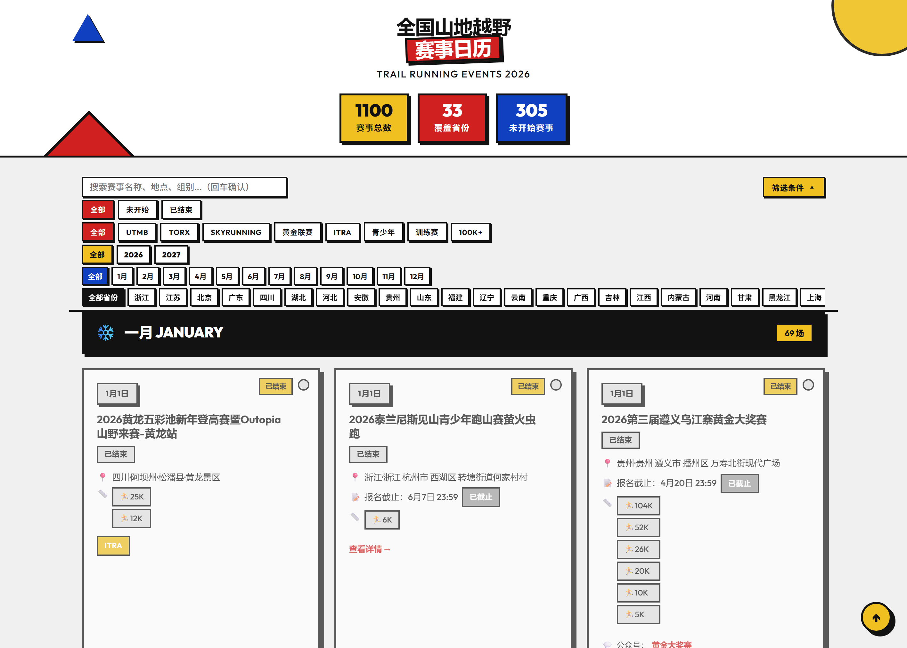

# China Trail Running Calendar 🏃⛰️

A **daily auto-updating** calendar of trail running races across China. It crawls multiple platforms and aggregates everything into one searchable, filterable web page.

> Data refreshes automatically every day at 00:00 (Beijing time / UTC+8). No manual maintenance needed.

📁 Want the **detailed project structure / internal flow**? → [`project/project.md`](./project/project.md)



*[中文说明 →](./README.md)*

---

## What is this

Trail races in China are scattered across platforms like Zuicool and UTMB. This project collects them into **one list** with date, location, categories, elevation gain, cut-off times, and certification tags (UTMB / Golden League / ITRA / Youth / Training race), organized by month.

Currently **840+ races** for 2026, covering 29 provinces.

---

## Live site

🌐 **https://nikiwang92.github.io/Trail-Running-calendar/**

> First-time setup: enable GitHub Pages under `Settings → Pages` with Source = `main` branch, root folder (see [Fork guide](#fork-your-own-calendar)).

---

## Features

- 🔍 **Search** by race name, location, or category (e.g. `100K`, `Beijing`)
- 🏷️ **Tag filters**: UTMB / Golden League / ITRA / Youth / Training / 100K+ (combinable)
- 📅 **Filter by status, month, and province**: Upcoming / Finished, by month, by province
- 📊 **Race details**: every official category with its elevation gain, cut-off time, WeChat account, and registration link
- 📱 **Responsive**: adapts to phone / tablet / desktop

---

## Data sources

| Platform | Notes |
|---|---|
| [Zuicool](https://zuicool.com) | Primary source, ~95% coverage |
| [UTMB World Series](https://www.utmb.world) | UTMB World Series China events |

Data comes from public pages and is for reference only — **always check the official race announcement**.

---

## Daily updates (automatic)

Nothing for you to do — it runs every day at 03:00 Beijing time:

1. **Crawl** (~1.5 min) — scans the full race list every day, and only fetches detail pages for **new** or **changed** races; a full refresh happens every 15 days
2. **Merge** — dedupes, fills in categories, recalculates status; backs up before every update
3. **Publish** — commits and redeploys the site

To check it's healthy: `your repo → Actions → Daily Update` (a green check means all good).

---

## Local preview

No dependencies needed — just double-click `index.html` (data is loaded via `<script src>`, which works under `file://`).

To modify data or run the crawlers, see the debugging section below.

---

## Fork your own calendar

Want your own version (your region / your year)? Follow these steps:

### 1. Fork the repository
Click **Fork** at the top-right of this page to get `your-username/Trail-Running-calendar`.

### 2. Enable auto-updates (GitHub Actions)
- Go to `your repo → Actions`
- If you see "Workflows aren't being run on this forked repository", click **I understand my workflows, go ahead and enable them**
- After that, it crawls and commits daily at UTC 19:00 (Beijing 03:00)

### 3. Enable web hosting (GitHub Pages)
- `Settings → Pages`
- Set **Source** to `Deploy from a branch`
- Set **Branch** to `main` + `/ (root)` → Save
- In a few minutes, visit `https://your-username.github.io/Trail-Running-calendar/`

> The repo ships with `.nojekyll` — without it, Pages' Jekyll would ignore `_race_data.js` (leading underscore) and the page would render empty.

### 4. Allow Actions to push (if you hit a permission error)
- `Settings → Actions → General → Workflow permissions`
- Select **Read and write permissions** → Save

### 5. Want only one region / one type?
- **One province only**: edit `crawlers/zuicool.py` near `crawl(year_filter=...)`, or add a filter in `scripts/merge_all.py`
- **Change the year**: search for `2026` and replace with your target year
- **Change the colors**: edit the CSS variables `--red / --blue / --yellow` at the top of `index.html`

---

## Debugging guide

### Data isn't updating?
1. Open `your repo → Actions → Daily Update` and check whether the latest run succeeded
2. Common causes of failure:
   - Actions write permission not enabled → see Fork step 4
   - Target site rate-limiting or site redesign → check the `[zuicool]` paging output in the logs
3. **Trigger a run manually**: `Actions → Daily Update → Run workflow`

### Run the whole pipeline locally
```bash
# 1) Crawl (incremental: only new/changed races, ~1–2 min)
python crawlers/zuicool.py
#    Force a full detail refresh (800+ pages, 15–40 min):
python crawlers/zuicool.py --full

# 2) Merge crawl results → _race_data.js
python scripts/merge_all.py

# 3) Recalculate status + refresh index.html
node daily_update.js

# 4) Open index.html in a browser to preview
```
> On Windows, set `PYTHONIOENCODING=utf-8` before running Python, or the console's GBK encoding will raise errors.

### A platform returns no data?
- Check the `count` in `crawl/output/{platform}.json`
- Check `crawl/REPORT_<date>.md` (the merge report)
- To inspect one specific race:
  ```bash
  python -c "import sys; sys.path.insert(0,'crawlers'); import zuicool as z; \
  print(z.parse_detail(z.fetch('https://zuicool.com/event/98816')))"
  ```

### Search / filters not responding?
1. Press `F12` in the browser and check the Console for red errors
2. Common cause: a race in `_race_data.js` is missing a field (e.g. empty `city`), which makes the script throw
3. Validate the data file:
   ```bash
   node -e "require('./_race_data.js'); console.log('data OK')"
   ```
4. Validate the page script:
   ```bash
   node daily_update.js    # prints whether index.html JS syntax is OK
   ```

### Preview changes instantly
Just double-click `index.html` and refresh — no build, no server needed.

---

## Tech stack

- **Scraping**: Python 3 + requests + BeautifulSoup
- **Storage**: a single CommonJS file, `_race_data.js`
- **Frontend**: vanilla HTML / CSS / JavaScript (zero dependencies, zero build)
- **Automation**: GitHub Actions + GitHub Pages

For the **detailed project structure and internal flow**, see [`project/project.md`](./project/project.md).

---

## License & credits

Data copyright belongs to the respective race organizers and platforms; this project only aggregates and displays it. Issues and PRs are welcome.

If this tool helped you, a ⭐ is appreciated.
